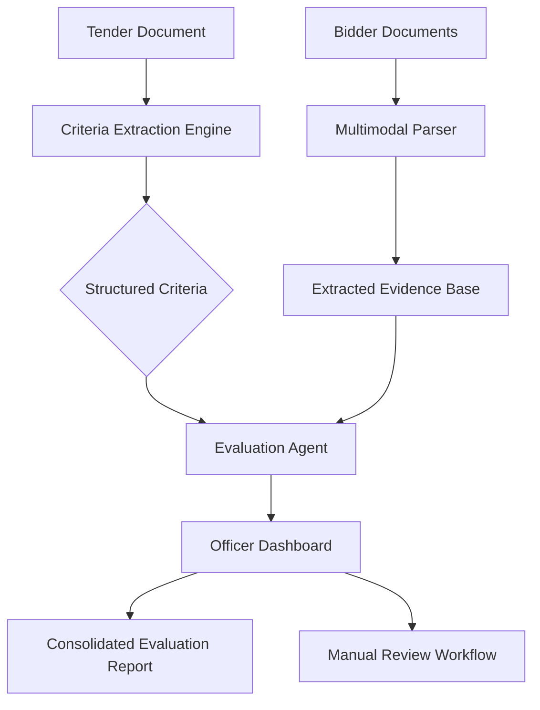

# AI-Based Tender Evaluation and Eligibility Analysis: A Technical Proposal for CRPF

## 1. Executive Summary
Government procurement processes, particularly within the **Central Reserve Police Force (CRPF)**, are governed by stringent compliance standards (GFR 2017) and complex "Two-Bid" systems. The current manual evaluation of bidder eligibility is a bottleneck—prone to human error, inconsistency, and audit risks.

Our proposed solution, **Aura-Tender**, is an AI-driven platform that automates the extraction of eligibility criteria and the evaluation of bidder submissions. By utilizing **Native Multimodal Large Language Models (LLMs)**, Aura-Tender can "read" scanned documents, stamps, and signatures directly, ensuring that no technicality is missed. The platform provides a transparent, explainable, and auditable trail for every decision, empowering procurement officers to make faster, more confident awards.

---

## 2. Problem Understanding: The Realities of Procurement
Government procurement isn't just about finding the lowest price; it's about **rigorous compliance**. 

### The Challenges:
*   **The "Two-Bid" Safeguard**: Evaluation must happen in silos—Technical/Eligibility first, Financial second. Opening a financial bid before technical qualification is a major procedural violation.
*   **Heterogeneous Evidence**: Bidders provide proof in chaotic formats—scanned CA certificates, mobile photos of ISO certifications, and hundreds of pages of bank statements.
*   **The Audit Trail**: Every disqualification must be legally defensible. A simple "rejected" is insufficient; the officer must cite the exact clause and the specific missing or non-compliant document.
*   **The Fatigue Factor**: Evaluating 10 bidders across 50 criteria means 500 "checks". Human evaluators often suffer from "oversight fatigue," leading to potential litigation from excluded bidders.

---

## 3. Technical Approach

### Phase A: Understanding the Tender (Criterion Extraction)
We don't just "read text"; we **structure requirements**.
1.  **Hierarchical Parsing**: The system ingests the Tender Enquiry (TE) and uses a Zero-Shot Extraction model to identify clauses.
2.  **Category Tagging**: Criteria are classified into:
    *   **Mandatory (Preliminary)**: EMD, Blacklisting Affidavit, GST/PAN.
    *   **Technical**: Past performance, OEM Authorization, Certifications.
    *   **Financial**: Average Turnover, Solvency, Net worth.
3.  **Constraint Modeling**: The AI converts human language (e.g., *"Min ₹5 Cr turnover in last 3 years"*) into validatable schemas: `{ "type": "financial", "operator": ">=", "value": 50000000, "unit": "INR", "period": "3_years" }`.

### Phase B: Understanding the Bidder (Multimodal Parsing)
Traditional OCR converts everything to plain text, losing the **spatial context** (e.g., a signature's position or a stamp's validity).
*   **Multimodal LLMs (Gemini 1.5 Pro)**: We process pages as images. The model identifies not just the words but the **authenticity markers** (Official stamps, QR codes on certificates).
*   **Evidence Pinpointing**: For every criterion, the engine searches the bidder's "Digital Folder" to find local evidence. 
    *   *Example*: It finds the "Balance Sheet" page across 200 pages and extracts the specific "Total Turnover" cell from the table.

### Phase C: Evaluation & Explainability
The system generates a **Criterion-Level Verdict**:
*   **Status**: `ELIGIBLE`, `NOT_ELIGIBLE`, or `NEEDS_REVIEW`.
*   **The "Why"**: *"Bidder provided Turnover Certificate on Page 42. Value found: ₹4.8 Cr. Required: ₹5 Cr."*
*   **The "Where"**: A deep link to the specific page and a highlighted bounding box around the evidence.

---

## 4. Architecture Overview

### High-Level Data Flow

### Key Technology Choices
1.  **Core AI**: **Gemini 1.5 Pro**. Selected for its **2-Million Token Window** (capable of "holding" an entire 1000-page bid in memory) and native multimodal capabilities.
2.  **Orchestration**: **LangGraph**. To handle the stateful "Two-Bid" logic (ensuring financial bids stay "encrypted" or "hidden" until technical qualification).
3.  **Vector DB**: **ChromaDB/Pinecone**. For semantic retrieval of specific clauses and cross-referencing past tender patterns.
4.  **UI/UX**: **React + TailwindCSS**. A "Military-Grade" dashboard focusing on density, clarity, and side-by-side verification (Criterion vs. Evidence).

---

## 5. Non-Negotiables & Governance

### No "Silent Disqualification"
If the AI encounters a blurry scan or a non-standard document formatting it cannot parse with >95% confidence, it flags it as **`AMBIGUOUS`**. The system prompts the officer: *"Found a document that looks like an ISO certificate, but the expiry date is unreadable. Please check Page 14."*

### Auditability
Every interaction with the LLM is logged with:
*   **Input Prompt**: The specific query sent.
*   **Output Trace**: The reasoning chain.
*   **Document Hash**: Verification that the document wasn't altered post-submission.
*   **Timestamp & User ID**: Tracking which officer reviewed or overrode a decision.

---

## 6. Risks and Trade-offs

| Risk | Mitigation |
| :--- | :--- |
| **Hallucination** | Use standard RAG (Retrieval Augmented Generation) with **Strict Grounding**. The AI is forbidden from answering without a direct citation from the PDF. |
| **OCR Quality** | Using Multimodal models instead of legacy OCR; fallback to "Human-in-the-loop" for low-confidence areas. |
| **Security** | PII (Personally Identifiable Information) masking and local/VPC deployment options to adhere to CRPF security protocols. |

---

## 7. Implementation Roadmap (Round 2)

### Week 1: Foundation
*   Setup Sandbox environment.
*   Ingest sample CRPF Tender Enquiry documents.
*   Fine-tune prompt templates for "Indian Legalese" extraction.

### Week 2: The Parser
*   Build the Multimodal extraction pipeline.
*   Implement table parser for financial statements and work order lists.

### Week 3: Dashboard & Review
*   Develop the Officer Interface.
*   Implement the "Side-by-Side" verification view.
*   Integrate the audit logging system.

### Week 4: Stress Testing
*   Testing with "Dark Data": Scanned faxes, low-light photos of certificates, and multi-layered PDFs.
*   Validation against manual evaluation benchmarks.

---

**Prepared for**: CRPF Hackathon - Round 1 Submission
**Proposed by**: Antigravity AI
